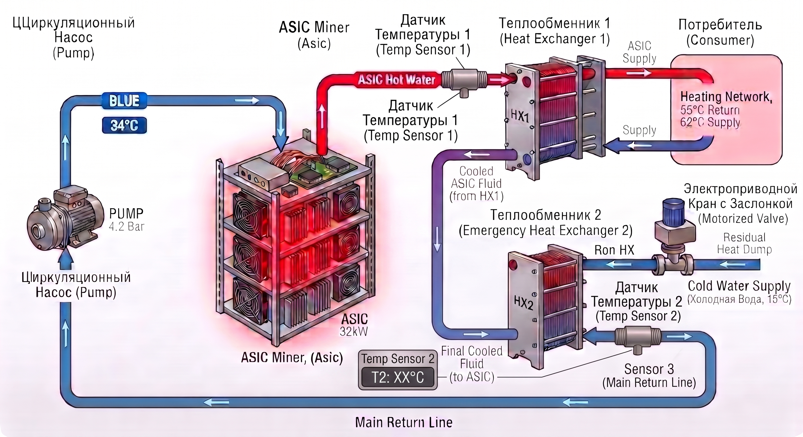

⚡ ESP32 ASIC Hydro & Immersion Cooling Controller (ES32D26)
===========================================================

Промышленный контроллер автоматики для систем водяного (Hydro) и иммерсионного (Immersion) охлаждения ASIC-майнеров. Прошивка разработана под плату **Eletechsup ES32D26** на базе ESP32 и управляет силовыми реле, заслонками сброса тепла ($4\text{--}20\text{ мА}$) и сухими градирнями ($0\text{--}10\text{ В}$), считывает давление по Modbus RTU, осуществляет локальное ПИД-регулирование температуры и интегрируется с **Home Assistant**.



📋 История изменений (Changelog)
--------------------------------

### **v4.0.5 Pro FreeRTOS Edition (Текущая версия)**

-   🧠 **FreeRTOS Dual-Core Architecture:**

    -   **Core 1 (Real-Time Control):** Изолированная задача `TaskControl` --- строго детерминированный контур реального времени ($100\text{ мс}$ / `vTaskDelayUntil`). Расчет ПИД, Slew Rate Limiter ЦАПа, асинхронный опрос датчиков и FSM Антизалипания.

    -   **Core 0 (Network & MQTT):** Выполнение сетевого стека, Web-сервера и асинхронной обработки MQTT в `loop()`.

-   ⚡ **Thread-Safe Queues (`xQueue`):** Взаимодействие между событиями MQTT (Core 0) и исполнительным контуром ЦАП (Core 1) переведено на безопасные очереди FreeRTOS.

-   🌡️ **Неблокирующий OneWire (DS18B20):** Асинхронный опрос температуры с разделением старта конвертации и считывания (`setWaitForConversion(false)`). Полностью устранены задержки в $750\text{ мс}$.

-   🛡️ **WDT & CPU Reset Fix:**

    -   Исправлен сбой Task Watchdog Timer (TWDT) благодаря корректному распределению потоков по ядрам.

    - **Синхронизация тумблеров (Проходной режим):** Тумблеры с фиксацией на входах `IN1..IN8` работают по схеме XOR Toggle — переключение физического тумблера инвертирует текущее состояние реле без конфликта с командами из Home Assistant.

    -   Буфер Home Assistant Discovery вынесен в статический сегмент памяти для исключения переполнения стека (Stack Overflow).

    -   Web OTA эндпоинт `/update` защищен от ложных `ESP.restart()` при пустых HTTP POST запросах.

-   🔒 **NVS & MQTT Protection:**

    -   Защита от эхо-команд MQTT для исключения ложного перевода заслонки в ручной режим.

    -   Отклонение сбойных/дефолтных уставок $20.0^\circ\text{C}$ при подключении к брокеру.

    -   Гарантированное сохранение уставки температуры `pidSetpoint` в NVS.

    -   Динамический процент ЦАПа вынесен из NVS (сохраняется ресурс флеш-памяти).

🌟 Ключевые возможности
-----------------------

-   **Двухъядерная многозадачность FreeRTOS:**

    -   Гарантированное выполнение управляющего контура реального времени независимо от сетевых задержек или зависания MQTT-брокера.

-   **Два профиля управления выходом ЦАП (GPIO26):**

    -   **Заслонка/Кран ($4\text{--}20\text{ мА}$):** Масштабирование $0\% \rightarrow 4.00\text{ мА}$, $100\% \rightarrow 20.00\text{ мА}$.

    -   **Сухая градирня ($0\text{--}10\text{ В}$):** Масштабирование $0\% \rightarrow 0.00\text{ В}$, $100\% \rightarrow 10.00\text{ В}$.

-   **Надежность промышленных ПЛК:**

    -   Аппаратный Watchdog (`esp_task_wdt`) с таймаутом $30\text{ сек}$.

    -   Безопасный старт (Safe Boot): принудительное удерживание ЦАП в $0\%$ ($4.00\text{ мА}$ / $0.00\text{ В}$) при включении питания.

    -   Сохранение состояния реле, флагов ручного режима, выбранного профиля вывода и уставки ПИД в **NVS Preferences**.

-   **Локальный ПИД-регулятор (`QuickPID`):**

    -   Дискретность расчета: $5\text{ секунд}$, настраиваемая мертвая зона (Deadband $2.0\%$).

    -   Диапазон уставки $T_{out}$: **21.0°C -- 85.0°C**.

    -   Фильтрация шумов DS18B20 через **Exponential Moving Average (EMA)** ($\alpha = 0.08$).

-   **Плавный ход (Slew Rate Limiter):**

    -   Программный демпфер с шагом $0.2\%$ за цикл ($100\text{ мс}$) для защиты механики и предотвращения гидроударов.

-   **Антизалипание механики (Anti-Stuck FSM):**

    -   Автоматический 24-часовой суточный цикл полной отработки заслонки ($0\% \rightarrow 100\% \rightarrow 0\%$) для предотвращения заклинивания.

-   **Автоматизация Home Assistant:**

    -   Полный **MQTT Discovery** с уникальными `unique_id` для предотвращения дубликатов сущностей.

    -   Групповой **Master Switch** для запуска/останова всей гидросистемы.

-   **Мониторинг периферии:**

    -   Датчик давления по **RS485 Modbus RTU** (Holding Registers `0x0004`).

    -   Две независимые шины OneWire (DS18B20) для температур на входе ($T_{in}$) и выходе ($T_{out}$).

-   **Безопасный Web OTA:**

    -   Встроенный Web-сервер с авторизацией для прошивки по воздуху с валидацией бинарного файла перед перезагрузкой.

🛠️ Аппаратная архитектура (ES32D26) и компоненты
-------------------------------------------------

| **Периферия / Назначение** | **Оборудование / Интерфейс** | **Пины ESP32** | **Описание** |
| --- | --- | --- | --- |
| **Управляющая плата** | Eletechsup ES32D26 | --- | DIN-рейка (ESP32, 8 реле, RS485, DAC) |
| **Реле CH1..CH8** | `74HC595` (Сдвиговый регистр) | `SER`: 12, `OE`: 13, `RCLK`: 23, `SRCLK`: 22 | Управление 8 силовыми каналами |
| **Входы IN1..IN8** | `74HC165` (Сдвиговый регистр) | `QH`: 15, `CLK`: 2, `SH`: 0 | Физические тумблеры с фиксацией |
| **Аналоговый выход ЦАП** | `Io2` ($4\text{--}20\text{ мА}$) / `Vo2` ($0\text{--}10\text{ В}$) | `DAC2`: GPIO26 | Вывод сигнала на кран или частотник градирни |
| **Датчик давления** | Xuyang Starts Electricity G1/2'' | `TX0`: IO1, `RX0`: IO3, `DIR`: IO21 | Сенсор давления (RS485 Modbus RTU) |
| **Температура Tin** | OneWire (DS18B20) | GPIO19 | Контур входа жидкости |
| **Температура Tout** | OneWire (DS18B20) | GPIO18 | Контур выхода (обратка) |

🎛️ Настройка переключателей DIP (Hardware Output Config)
---------------------------------------------------------

Тип физического выхода канала 2 (GPIO26 / DAC2) согласовывается переключателями **SW1 DIP**:

| **Режим работы в программном коде** | **DIP 1 (Io2)** | **DIP 3 (Vo2)** | **Выходная клемма платы** |
| --- | --- | --- | --- |
| **`VALVE_4_20MA` (Заслонка / Кран)** | **ON** | **OFF** | Клеммы **`Io2`** и **`GND`** |
| **`DRY_COOLER_0_10V` (Градирня / VFD)** | **OFF** | **ON** | Клеммы **`Vo2`** и **`GND`** |

⚠️ ВАЖНО: Аппаратная доработка (Fix стартовых щелчков)
------------------------------------------------------

Для **100% исключения кратковременного срабатывания реле** при подаче питания или перезагрузке ESP32:

-   **Компонент:** Резистор **10 кОм** ($0.125\text{ Вт}$ / $0.25\text{ Вт}$).

-   **Точки подключения:** Соединить пин **`G13`** (Output Enable `74HC595`) и пин **`3V3`** на гребенке платы.

-   **Зачем:** Физический Pull-up блокирует выходы сдвигового регистра `74HC595` в состоянии HIGH на время инициализации микроконтроллера.

🔌 Назначение каналов реле (CH1 -- CH8)
--------------------------------------

-   **CH1 --- CH4:** Питание майнеров (ASIC 1 --- ASIC 4) / Тумблеры `IN1` -- `IN4`.

-   **CH5:** Циркуляционный насос гидроконтура (`asic/pump`) / Тумблер `IN5`.

-   **CH6:** Отсечной/сбросной клапан (`asic/valve`) / Тумблер `IN6`.

-   **CH7:** Дополнительное реле Aux 7 (`asic/relay7`) / Тумблер `IN7`.

-   **CH8:** Дополнительное реле Aux 8 (`asic/relay8`) / Тумблер `IN8`.

⚙️ Сборка через PlatformIO (`platformio.ini`)
---------------------------------------------

Ini, TOML

```
[env:esp32dev]
platform = espressif32
board = esp32dev
framework = arduino
monitor_speed = 115200
upload_speed = 921600

board_build.partitions = min_spiffs.csv

lib_deps =
    dlloydev/QuickPID @ ^3.1.9
    milesburton/DallasTemperature @ ^3.11.0
    paulstoffregen/OneWire @ ^2.3.7
    4-20ma/ModbusMaster @ ^2.0.1

build_flags =
    -D CORE_DEBUG_LEVEL=0
    -D CONFIG_ARDUHAL_LOG_COLORS=1

```

🌐 Структура MQTT Топиков
-------------------------

#### 📥 Управление (Subscribed):

-   **`asic/master/set`** --- Мастер-выключатель всей системы (`ON` / `OFF`).

-   **`asic/profile/set`** --- Выбор режима управления ЦАП (`VALVE_4_20MA` / `DRY_COOLER_0_10V`).

-   **`asic/pid/enable/set`** --- Включение/выключение авто-ПИД (`ON` / `OFF`).

-   **`asic/pid/force_manual/set`** --- Принудительное удержание ручного режима (`ON` / `OFF`).

-   **`asic/pid/invert/set`** --- Инверсия направления ПИД (`ON` --- Reverse/Охлаждение, `OFF` --- Direct).

-   **`asic/pid/setpoint/set`** --- Уставка целевой температуры $T_{out}$ (число `21.0`--`85.0`).

-   **`asic/pid/kp/set`**, **`ki/set`**, **`kd/set`** --- Настройка коэффициентов ПИД.

-   **`asic/damper/set`** --- Ручная установка заслонки (`0`--`100`). *При ручном вводе ПИД временно отключается.*

-   **`asic/relay1/set`** .. **`asic/relay4/set`** --- Управление майнерами (`ON` / `OFF`).

-   **`asic/pump/set`** --- Управление насосом (`ON` / `OFF`).

-   **`asic/valve/set`** --- Управление клапаном (`ON` / `OFF`).

-   **`asic/relay7/set`**, **`asic/relay8/set`** --- Дополнительные реле Aux 7, Aux 8 (`ON` / `OFF`).

-   **`asic/reset_nvs`** --- Очистка флеш-памяти и сброс настроек к заводским (`RESET`).

#### 📤 Метрики и состояния (Published):

-   **`asic/profile/state`** --- Активный профиль оборудования (`VALVE_4_20MA` или `DRY_COOLER_0_10V`).

-   **`asic/sensor/temp_in/state`** --- Температура на входе ($^\circ\text{C}$).

-   **`asic/sensor/temp_out/state`** --- Температура на выходе ($^\circ\text{C}$).

-   **`asic/sensor/pressure/state`** --- Давление в контуре ($\text{Bar}$).

-   **`asic/actuator/current_ma/state`** --- Фактический ток при профиле `VALVE_4_20MA` ($4.00\text{--}20.00\text{ мА}$).

-   **`asic/actuator/voltage_v/state`** --- Фактическое напряжение при профиле `DRY_COOLER_0_10V` ($0.00\text{--}10.00\text{ В}$).

-   **`asic/pid/revert_timer/state`** --- Обратный отсчет до автовозврата в ПИД-режим.

-   **`asic/status`** --- Статус контроллера (`online` / `offline`).

📜 Лицензия
-----------

Этот проект распространяется под лицензией MIT.