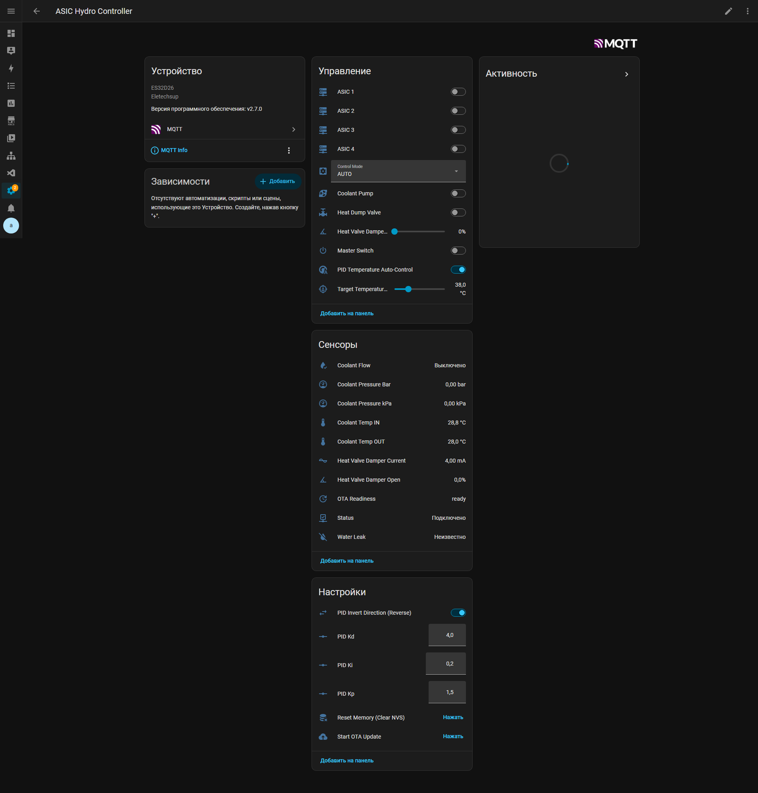

# ⚡ ESP32 ASIC Hydro & Immersion Cooling Controller (ES32D26)

[](http://www.eletechsup.com/)
[](https://www.espressif.com/)
[](https://www.home-assistant.io/)
[]()
[](LICENSE)

Промышленный контроллер автоматики для систем водяного (Hydro) и иммерсионного (Immersion) охлаждения ASIC-майнеров. Прошивка разработана под плату **Eletechsup ES32D26** на базе ESP32 и обеспечивает надежное управление насосами, заслонками сброса тепла (4–20 мА) и сухими градирнями (0–10 В), отслеживание давления по Modbus RTU, авторегулирование температуры по ПИД и асинхронную интеграцию с **Home Assistant**.

---

## 📋 История изменений (Changelog)

### **v3.8.0 (Selectable Profile & Dual Hardware Output)**
* 🎛️ **Переключение профилей охлаждения (Profile Selector):** Добавлена возможность выбора 1 из 2 режимов через MQTT / Home Assistant (`asic/profile/set`):
  * **`VALVE_4_20MA`:** Выход $4\text{–}20\text{ мА}$ для управления регулирующим краном / заслонкой.
  * **`DRY_COOLER_0_10V`:** Выход $0\text{–}10\text{ В}$ для управления частотно-регулируемым приводом (ЧРП / VFD) сухой градирни.
* 💾 **Энергонезависимое хранение профиля:** Выбранный режим сохраняется в **NVS-памяти** (`out_profile`) и автоматически загружается при старте.
* 🛡️ **Safe Boot (Безопасный запуск):** При подаче питания ЦАП принудительно выдает минимальный уровень: **$4.00\text{ мА}$** для клапана или **$0.00\text{ В}$** для градирни.
* ⚡ **ESP-IDF Native Async MQTT:** Нативный `mqtt_client.h` из состава ESP-IDF для максимальной стабильности соединения.
* ⌛ **Auto-Revert PID Timeout (15 мин):** При ручной подстройке заслонки запускается 15-минутный таймер автовозврата в режим ПИД-регулирования.
* 🔒 **Force Manual Mode:** Блокировка автовозврата ПИД с сохранением состояния в **NVS-памяти**.
* ⏱️ **Индикация таймера:** Сенсор `asic/pid/revert_timer/state` передает время до возврата в авторежим.
* 🛡️ **Защита от переполнения `millis()`:** Все таймеры переведены на беззнаковую арифметику `unsigned long`.

---

## 🌟 Ключевые возможности

* **Два профиля управления выходом ЦАП (GPIO26):**
  * **Заслонка/Кран ($4\text{–}20\text{ мА}$):** Масштабирование $0\% \rightarrow 4.00\text{ мА}$, $100\% \rightarrow 20.00\text{ мА}$.
  * **Сухая градирня ($0\text{–}10\text{ В}$):** Масштабирование $0\% \rightarrow 0.00\text{ В}$, $100\% \rightarrow 10.00\text{ В}$.
* **Надежность промышленных ПЛК:**
  * Встроенный аппаратный Watchdog (`esp_task_wdt`) с таймаутом 15 сек.
  * Безопасный запуск: аппаратная блокировка реле при подаче питания.
  * Энергонезависимое хранение состояния реле, `isForceManual`, выбранного профиля вывода и параметров ПИД в **NVS Preferences**.
* **Локальный ПИД-регулятор (`QuickPID`):**
  * Полностью автономный расчет прямо на ESP32.
  * Настраиваемый диапазон уставки $T_{out}$: **20.0°C – 85.0°C**.
  * Фильтрация шумов DS18B20 через **Exponential Moving Average (EMA)**.
  * Настраиваемая мертвая зона (Deadband 1.0%) для устранения постоянного дребезга привода.
  * Переключатель инверсии ПИД (`Direct` / `Reverse`).
* **Плавный ход (Slew Rate Limiter):**
  * Программный демпфер плавного изменения сигнала ЦАП для защиты механики и исключения гидравлических ударов.
* **Автоматизация Home Assistant:**
  * Полный **MQTT Discovery** (все 8 реле, селектор оборудования, регуляторы уставки и коэффициентов, таймер возврата, сенсоры давления, тока 4–20 мА и напряжения 0–10 В).
  * Групповой **Master Switch** для запуска/останова всей гидросистемы одной кнопкой.
* **Мониторинг периферии:**
  * Датчик давления по **RS485 Modbus RTU** (Holding Registers `0x0004`).
  * Две независимые шины OneWire (DS18B20) для температур на входе ($T_{in}$) и выходе ($T_{out}$).
  * Аварийный авто-останов при протечке (триггер `leak`).
* **Обновление и Web-интерфейс:**
  * Встроенный Web-сервер с авторизацией для обновления прошивки «по воздуху» (Web OTA).

---

## 🛠️ Аппаратная архитектура (ES32D26) и компоненты

| Периферия / Назначение | Оборудование / Интерфейс | Пины ESP32 | Описание |
| :--- | :--- | :--- | :--- |
| **Управляющая плата** | Eletechsup ES32D26 | — | Плата DIN-рейка (ESP32, 8 реле, RS485, DAC) |
| **Реле CH1..CH8** | `74HC595` (Сдвиговый регистр) | `SER`: 12, `OE`: 13, `RCLK`: 23, `SRCLK`: 22 | Управление 8 силовыми каналами |
| **Входы IN1..IN8** | `74HC165` (Сдвиговый регистр) | `QH`: 15, `CLK`: 2, `SH`: 0 | Физические выключатели с фиксацией |
| **Аналоговый выход ЦАП** | `Io2` (4–20 мА) / `Vo2` (0–10 В) | `DAC2`: GPIO26 | Вывод сигнала на кран или частотник градирни |
| **Датчик давления** | Xuyang Starts Electricity G1/2'' | `TX0`: IO1, `RX0`: IO3, `DIR`: IO21 | Промышленный сенсор (RS485 Modbus RTU) |
| **Температура Tin** | OneWire (DS18B20) | GPIO19 | Контур входа жидкости |
| **Температура Tout** | OneWire (DS18B20) | GPIO18 | Контур выхода (обратка)[cite: 3] |

---

## 🎛️ Настройка переключателей DIP (Hardware Output Config)

Тип физического выхода канала 2 (GPIO26 / DAC2) согласовывается переключателями **SW1 DIP**:

| Режим работы в программном коде | DIP 1 (`Io2`) | DIP 3 (`Vo2`) | Выходная клемма платы |
| :--- | :---: | :---: | :--- |
| **`VALVE_4_20MA` (Заслонка / Кран)** | **ON** | **OFF** | Клеммы **`Io2`** и **`GND`** |
| **`DRY_COOLER_0_10V` (Градирня / VFD)** | **OFF** | **ON** | Клеммы **`Vo2`** и **`GND`** |

---

## ⚠️ ВАЖНО: Аппаратная доработка (Fix стартовых щелчков)

Для **100% исключения кратковременного срабатывания реле** при подаче питания или перезагрузке ESP32[cite: 3]:

* **Компонент:** Резистор **10 кОм** (0.125 Вт / 0.25 Вт)[cite: 3].
* **Точки подключения:** Соединить пин **`G13`** (Output Enable `74HC595`) и пин **`3V3`** на гребенке платы[cite: 3].
* **Зачем:** Физический Pull-up блокирует выходы сдвигового регистра `74HC595` в состоянии HIGH на время инициализации микроконтроллера[cite: 3].

---

## 🔌 Назначение каналов реле (CH1 – CH8)

* **CH1 — CH4:** Питание майнеров (ASIC 1 — ASIC 4) / Тумблеры `IN1` – `IN4`[cite: 3].
* **CH5:** Циркуляционный насос гидроконтура (`asic/pump`) / Тумблер `IN5`[cite: 3].
* **CH6:** Отсечной/сбросной клапан (`asic/valve`) / Тумблер `IN6`[cite: 3].
* **CH7:** Дополнительное реле Aux 7 (`asic/relay7`) / Тумблер `IN7`[cite: 3].
* **CH8:** Дополнительное реле Aux 8 (`asic/relay8`) / Тумблер `IN8`[cite: 3].

---

## ⚙️ Сборка через PlatformIO (`platformio.ini`)

```ini
[env:esp32dev]
platform = espressif32
board = esp32dev
framework = arduino
monitor_speed = 115200
upload_speed = 921600

board_build.partitions = min_spiffs.csv

lib_deps =
    dlloydev/QuickPID @ ^3.1.9
    milesburton/DallasTemperature @ ^3.11.0
    paulstoffregen/OneWire @ ^2.3.7
    4-20ma/ModbusMaster @ ^2.0.1

build_flags =
    -D CORE_DEBUG_LEVEL=0
    -D CONFIG_ARDUHAL_LOG_COLORS=1
```

🌐 Структура MQTT Топиков
-------------------------

#### 📥 Управление (Subscribed):

*   **asic/master/set** — Мастер-выключатель всей системы (ON / OFF).

*   **asic/profile/set** — Выбор режима управления ЦАП (VALVE_4_20MA / DRY_COOLER_0_10V).
    
*   **asic/pid/enable/set** — Включение/выключение авто-ПИД (ON / OFF).
    
*   **asic/pid/invert/set** — Инверсия направления ПИД (ON — Reverse/Охлаждение, OFF — Direct).
    
*   **asic/pid/setpoint/set** — Уставка целевой температуры $T\_{out}$ (число 20.0–85.0).
    
*   **asic/pid/kp/set**, **ki/set**, **kd/set** — Настройка коэффициентов ПИД.
    
*   **asic/damper/set** — Ручная установка заслонки (0–100). _При ручном вводе ПИД автоматически выключается._
    
*   **asic/relay1/set** .. **asic/relay4/set** — Управление майнерами (ON / OFF).

*   **asic/relay7/set** — Дополнительное реле Aux 7. (ON / OFF).

*   **asic/relay8/set** — Дополнительное реле Aux 8. (ON / OFF).

*   **asic/pump/set** — Управление насосом (ON / OFF).
    
*   **asic/sensor/leak/set** — Аварийный триггер протечки (ON).

*   **asic/reset_nvs** — Очистка флеш-памяти и сброс настроек к заводским (RESET).
    

##### 📤 Метрики и состояния (Published):

*  **asic/profile/state** — Активный профиль оборудования (VALVE_4_20MA или DRY_COOLER_0_10V).

*   **asic/sensor/temp\_in/state** — Температура на входе (°C).
    
*   **asic/sensor/temp\_out/state** — Температура на выходе (°C).
    
*   **asic/sensor/pressure/state** — Давление в контуре (Bar).
    
*   **asic/actuator/current_ma/state** — Фактический ток при профиле VALVE_4_20MA (4.00–20.00 мА).

*   **asic/actuator/voltage_v/state** — Фактическое напряжение при профиле DRY_COOLER_0_10V (0.00–10.00 В).

*   **asic/pid/revert_timer/state** — Обратный отсчет до автовозврата в ПИД-режим.
    
*   **asic/status** — Статус контроллера (online / offline).



📜 Лицензия
Этот проект распространяется под лицензией MIT.